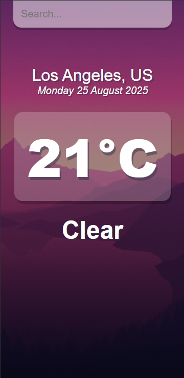
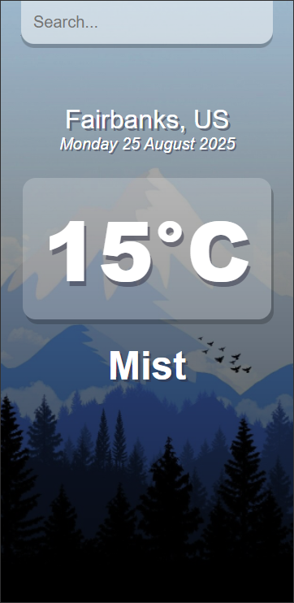

🌤️ Simple Weather App

A simple React weather app built with the OpenWeather API.
The app is designed primarily for mobile view and lets you search for a location to see the current temperature and date.

🚀 Features

Search for a city or location

Display current temperature

Mobile layout

🛠️ Tech Stack

React

OpenWeather API

## 📷 Preview

  
  
  

